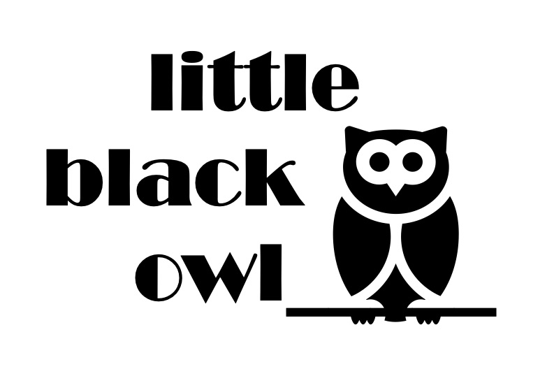

<!-- Example of title -->
My exercise is Markdown<!-- omit in toc -->

<!-- Here comes the table of content -->
Table of contents
- [Paragraphs](#paragraphs)
- [Links and images](#links-and-images)
  - [Links](#links)
  - [Images](#images)

# Paragraphs

<!-- Example of paragraph of text with line break -->
This is a very easy exercise.  
I still hope I'll be able to do it correctly.
Yay!

<!-- Example of another paragraph -->
This is yet another paragraph and this paragraph is very long.

<!-- Example of bold -->
This is **bold** text and this is __bold__ text, too. :D

<!-- Example of italic  -->
This is _italic_ text.
This is *italic* text, too.

<!-- Example of strikethrough  -->
This is ~~not~~ the text I like.

<!-- Example of headers -->
# Links and images
## Links
<!-- Example of external link -->
[Webpage on Localization](https://localization.pl)

<!-- Example of link to another file -->
[Additional information](New_File.md)
## Images
<!-- Example of an image -->

<!-- Example of an image with hover text -->

<!-- Example of equation or inline code -->

<!-- Example of a block of code -->

<!-- Example of code highlighting -->

<!-- Example of quote -->

<!-- Example of bullet list -->

<!-- Example of numbered list -->

<!-- Example of table -->
| No. | Species | Name    |
| --- | ------- | ------- |
| 1   | Bird    | Owl     |
| 2   | Mammal  | Seal    |
| 3   | Bird    | Sparrow |

If you want to mark the end of your table, add one line.

<!-- Paragraph after table -->
