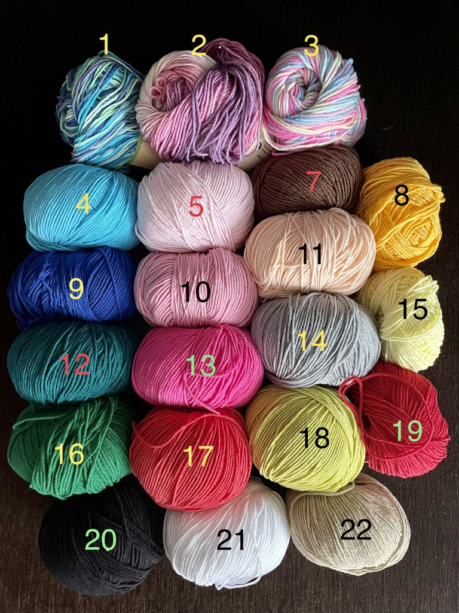

<!-- Example of title -->
**How to crochet amigurumi**<!-- omit in toc -->

**Amigurumi** is the Japanese art of knitting or crocheting small, stuffed yarn creatures.

<!-- Here comes the table of content -->
What you need:
- [Yarn](#yarn)
  - [Types and colours](#types-and-colours)
    - [Types](#types)
    - [Colours](#colours)
- [Fiberfill](#fiberfill)
- [Tools](#tools)
  - [Hook](#hook)
  - [Yarn needle](#yarn-needle)
  - [Stitch markers](#stitch-markers)

# How to crochet amigurumi<!-- omit in toc -->

<!-- Example of paragraph of text with line break -->
Crocheting amigurumi can be a lot of fun.  
You just need to try it yourself.  

<!-- Example of another paragraph -->
**Ready?**

<!-- Example of bold -->
**Steady?**

__Crochet away!__

<!-- Example of italic  -->
It is very _easy_.
*Not* difficult as some think.

<!-- Example of strikethrough  -->
This will definitely ~~not~~ put a smile on your face.

<!-- Example of headers -->
# Yarn
## Types and colours
### Types
<!-- Example of external link -->
[Let's look at yarn types here](https://www.cuddlystitchescraft.com/best-yarn-for-making-amigurumi/)

<!-- Example of link to another file -->
[And here you'll learn more about acrylic and cotton](YarnTypes.md)

### Colours
<!-- Example of an image -->

<!-- Example of an image with hover text -->

# Fiberfill
**Fiberfill** is quick-drying synthetic stuffing for cushions that resists mildew.

You will find fiberfill [here](https://allegro.pl/listing?string=kulka%20silikonowa&order=p).

# Tools
To start crocheting your amigurumi, you will need the following tools:

## Hook

## Yarn needle

## Stitch markers

<!-- Example of equation or inline code -->

<!-- Example of a block of code -->
1. Open the file.
2. Find the following block of code:

        <html>
            <head>
                <title>Crocheting</title>
            </head>

3. Change the title to the name of your choice.

<!-- Example of code highlighting -->
When prompted, type `amigurumi`.

<!-- Example of quote -->
> Pursuing your hobby is a waste of time. Said no one ever.

<!-- Example of bullet list -->
A few yarn brands:
- Yarn Art Jeans
- Yarn Art Jeans Plus
- Himalaya Dolphin Baby

<!-- Example of numbered list -->
A few more yarn brands:  
1. Yarn Art Jeans Crazy
2. Gazzal Baby Cotton
3. Drops Baby Merino

<!-- Example of table -->
| Yarn number | Yarn brand     | Colour     |
| ----------- | -------------- | ---------- |
| 01          | Yarn Art Jeans | White      |
| 20          | Yarn Art Jeans | Light pink |
| 35          | Yarn Art Jeans | Yellow     |

These are some examples of yarn colors.

<!-- Paragraph after table -->
You will find more yarn colors [here](https://www.olimoripasmanteria.pl/kategoria-produktu/wloczki/jeans/).